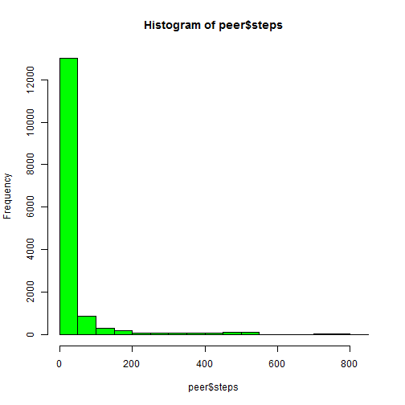
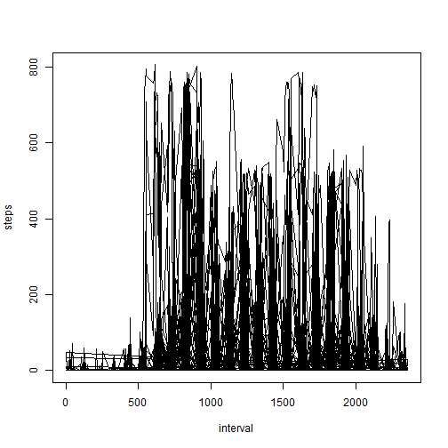
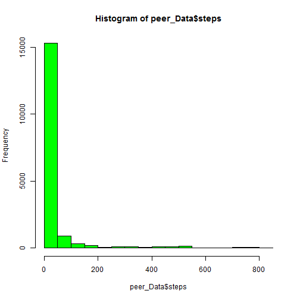
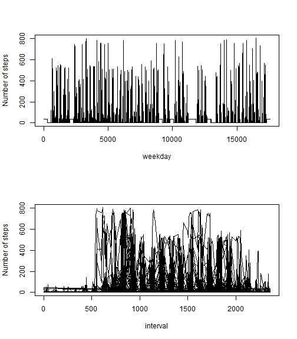

Peer Assessment
===============

Lets load the activity data


```r
getwd()
```

```
## [1] "C:/Users/jmatimba/RepData_PeerAssessment1"
```

```r
peer <- read.csv("activity.csv")
```


Now lets make a histogram of the total number of steps taken each day


```r
hist(peer$steps, col="green")
```

 

Calculating and report the mean and median total number of steps taken per day


```r
summary(peer$steps)
```

```
##    Min. 1st Qu.  Median    Mean 3rd Qu.    Max.    NA's 
##     0.0     0.0     0.0    37.4    12.0   806.0    2304
```

Let's make a time series plot (i.e. type = "l") of the 5-minute interval (x-axis) and the average number of steps taken(y-axis)

```r
plot(peer$interval,
     peer$steps,
     xlab = "interval",
     ylab = "steps",
     main = "",
     type = "l"
)
```

 

Imputing missing values:
Calculating and reporting the total number of missing values in the dataset


```r
bad <- is.na(peer)
sum(bad)
```

```
## [1] 2304
```

Let's fill out the missing values with the mean of the non-missing entries


```r
library(gam)
```

```
## Loading required package: splines
## Loaded gam 1.09
```

```r
peer_Data <- na.gam.replace (peer)
```

Here's a new dataset that is equal to the original dataset but with the missing data filled in

```r
tail(peer_Data)
```

```
##       steps       date interval
## 17563 37.38 2012-11-30     2330
## 17564 37.38 2012-11-30     2335
## 17565 37.38 2012-11-30     2340
## 17566 37.38 2012-11-30     2345
## 17567 37.38 2012-11-30     2350
## 17568 37.38 2012-11-30     2355
```

Making a histogram of the total number of steps taken each day

```r
hist(peer_Data$steps, col="green")
```

 

Calculate and report the mean and median total number of steps taken per day

```r
summary(peer_Data$steps)
```

```
##    Min. 1st Qu.  Median    Mean 3rd Qu.    Max. 
##     0.0     0.0     0.0    37.4    37.4   806.0
```
From the results above, it shows that the results are the same as the first part of the assignment. The impact is that the data does not change by much, it actualy revolves around the same median and mean.


Are there differences in activity patterns between weekdays and weekends?

Now lets create a new factor variable in the dataset with two levels - "weekday" and "weekend"

```r
dates <- weekdays(as.Date(peer_Data$date))
```

Here we make a panel plot containing a time series plot

```r
par(mfrow = c(2,1))
plot(peer_Data$steps, peer_Data$dates, type = 'l', ylab = 'Number of steps', xlab = 'weekday')
plot(peer_Data$interval, peer_Data$steps, type = 'l', ylab = 'Number of steps', xlab =  'interval')
```

 


